# Exercise 1 — Tasks

Find the title of each film

```sql
SELECT title from movies
```

Find the director of each film

```sql
SELECT director from movies
```

Find the title and director of each film

```sql
SELECT title, director from movies
```

Find the title and year of each film

```sql
SELECT title, year from movies
```

Find all the information about each film

```sql
SELECT * from movies
```

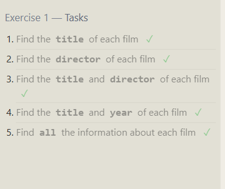

# Exercise 2 — Tasks

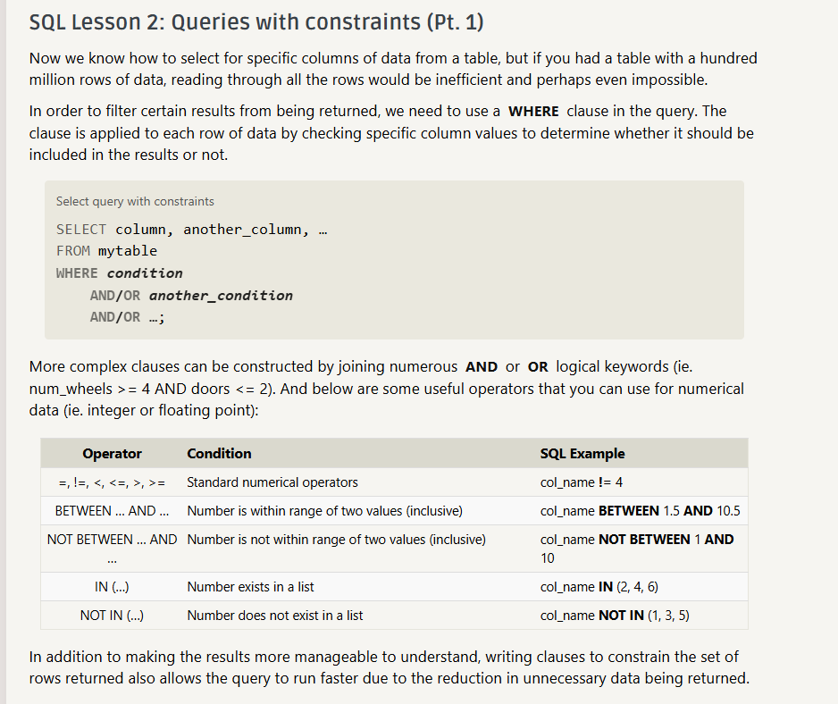

Find the movie with a row id of 6

```sql
SELECT title FROM movies WHERE id = 6;
```

Find the movies released in the years between 2000 and 2010

```sql
SELECT title FROM movies WHERE year >= 2000 AND year <= 2010;

SELECT title FROM movies WHERE year BETWEEN 2000 and 2010;
```

Find the movies not released in the years between 2000 and 2010

```sql
SELECT title FROM movies WHERE year NOT BETWEEN 2000 and 2010;
```

Find the first 5 Pixar movies and their release year

```sql
SELECT title FROM movies where id between 1 and 5;
```

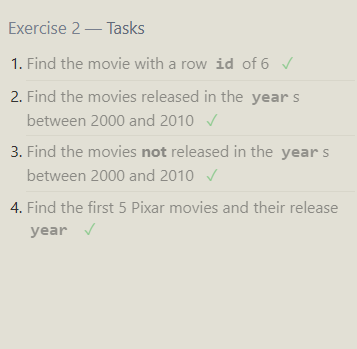

# Exercise 3 — Tasks

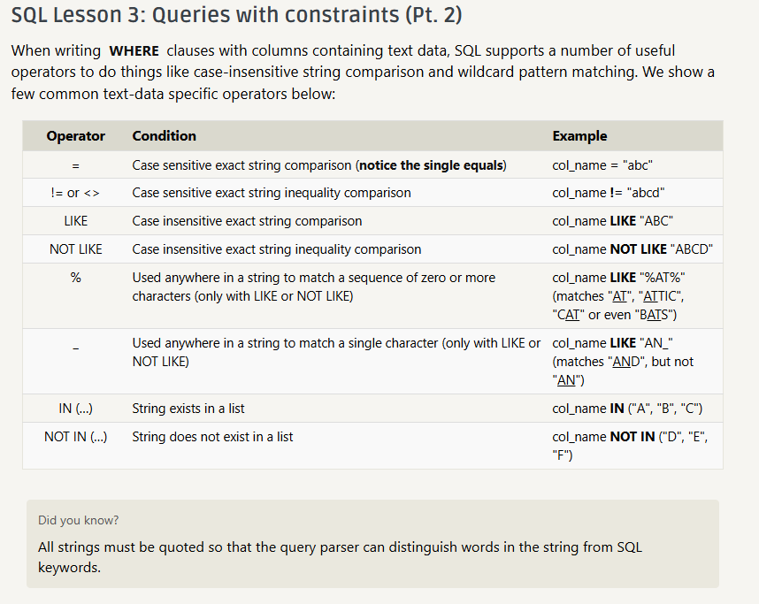

Find all the Toy Story movies

```sql
SELECT * FROM movies WHERE title LIKE "toy story%";
```

Find all the movies directed by John Lasseter

```sql
SELECT * FROM movies WHERE director LIKE "John Lasseter";
```

Find all the movies (and director) not directed by John Lasseter

```sql
SELECT * FROM movies WHERE director NOT LIKE "John Lasseter";
```

Find all the WALL-\* movies

```sql
SELECT * FROM movies WHERE title LIKE "wall-%";

```

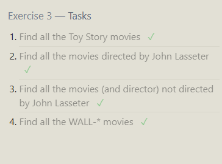

# Exercise 4 — Tasks

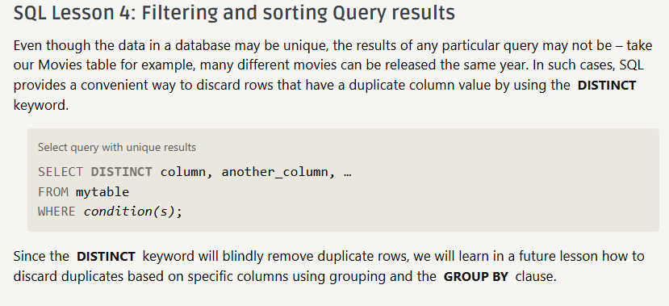
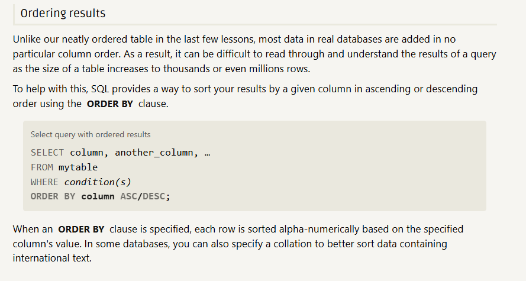
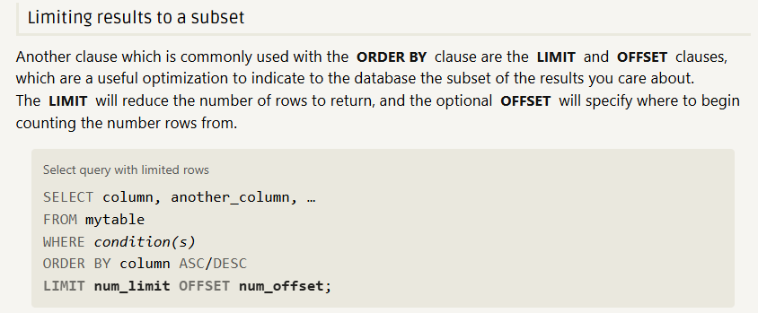

List all directors of Pixar movies (alphabetically), without duplicates

```sql
SELECT DISTINCT director FROM movies order by director asc;
```

List the last four Pixar movies released (ordered from most recent to least)

```sql
SELECT * FROM movies ORDER BY year desc LIMIT 4 ;
```

List the first five Pixar movies sorted alphabetically

```sql
SELECT * FROM movies order by title, year asc limit 5;
```

List the next five Pixar movies sorted alphabeticall

```sql
SELECT * FROM movies order by title, year asc limit 5 offset 5;
```

# Review 1 — Tasks

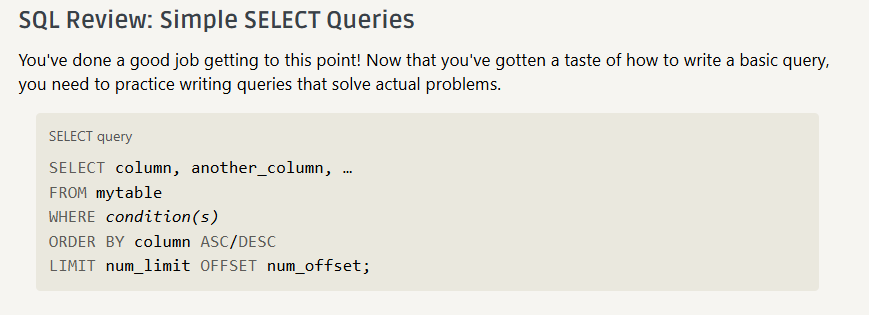

List all the Canadian cities and their populations

```sql
SELECT * FROM north_american_cities where country like "canada";
```

Order all the cities in the United States by their latitude from north to south

```sql
SELECT * FROM north_american_cities where country like "united states" order by latitude desc;
```

List all the cities west of Chicago, ordered from west to east

```sql
SELECT * FROM north_american_cities
order by longitude asc
limit 6;


SELECT *
FROM north_american_cities
WHERE longitude < (SELECT longitude FROM nort_american_cities WHERE city = "Chicago")
Order by longitude

```

List the two largest cities in Mexico (by population)

```sql
SELECT * FROM north_american_cities
where country = "Mexico"
order by population desc
limit 2;

```

List the third and fourth largest cities (by population) in the United States and their population

```sql
SELECT * FROM north_american_cities
where country = "United States"
order by population desc
limit 2 offset 2;
```

# On joining

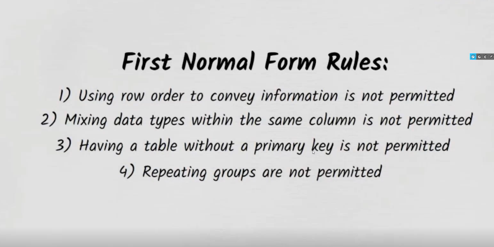

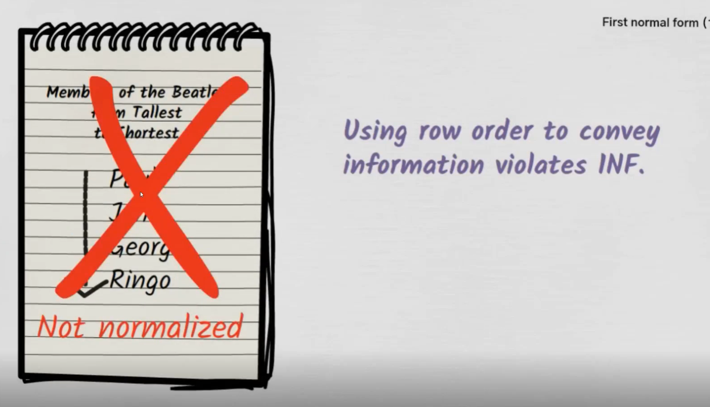

## 1. both data visible:

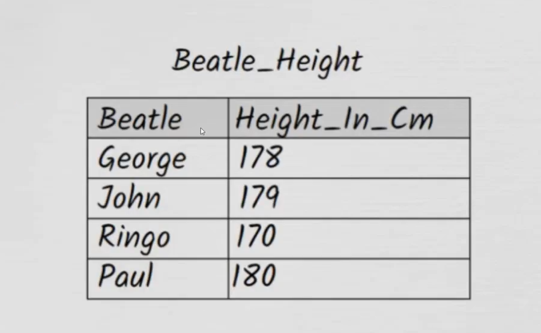

## 2. mixing data types not allowed

## 3. having table without primary key not permitted

- unique
- not null
- only one in a table

## 4. repeating group not permitted

## second normal from

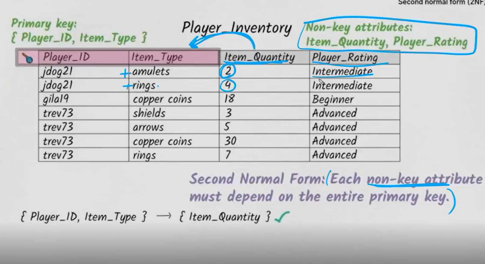

## third normal from

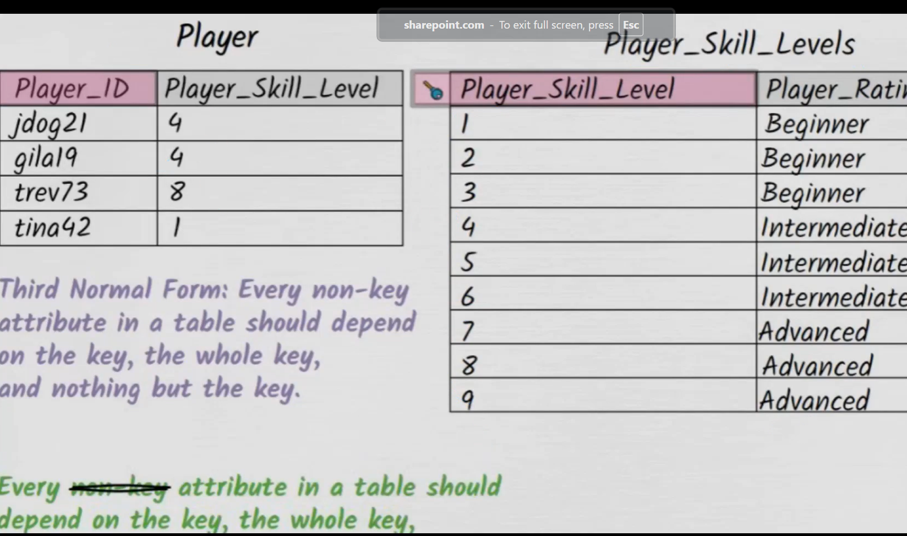

# Exercise 6 — Tasks

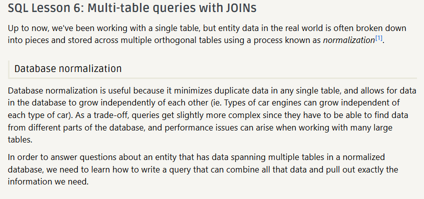
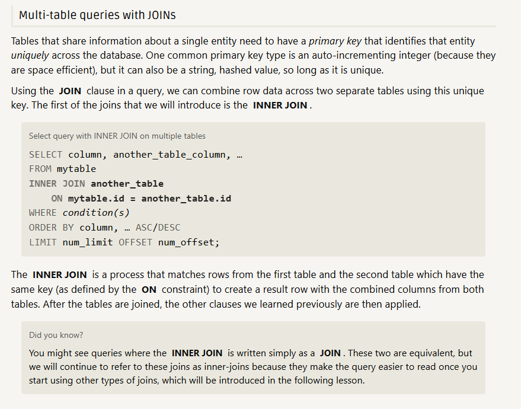

Find the domestic and international sales for each movie

```sql
SELECT *
FROM movies
INNER JOIN Boxoffice
on Movies.id = Boxoffice.Movie_id;
```

Show the sales numbers for each movie that did better internationally rather than domestically

```sql
SELECT *
FROM movies
INNER JOIN Boxoffice
on Movies.id = Boxoffice.Movie_id
WHERE boxoffice.international_sales>boxoffice.domestic_sales;
```

List all the movies by their ratings in descending order

```sql
SELECT *
FROM movies
INNER JOIN Boxoffice
on Movies.id = Boxoffice.Movie_id
ORDER BY boxoffice.rating desc;
```

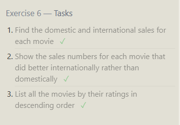

# Exercise 7 — Tasks

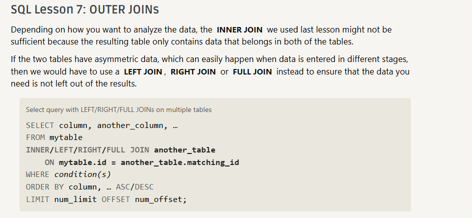
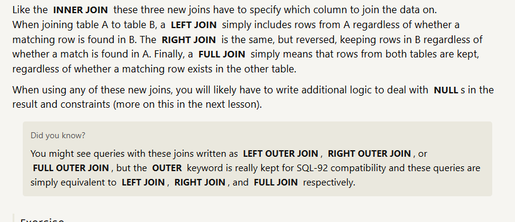

Find the list of all buildings that have employees

```sql
SELECT DISTINCT building
FROM employees;
```

Find the list of all buildings and their capacity

```sql
SELECT *
FROM buildings;
```

List all buildings and the distinct employee roles in each building (including empty buildings)

```sql
SELECT DISTINCT
buildings.building_name, employees.role
FROM buildings
LEFT JOIN employees
on  buildings.building_name = employees.building;
```

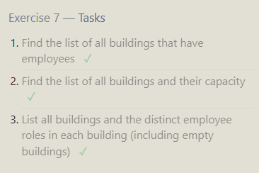

# Exercise 8 — Tasks

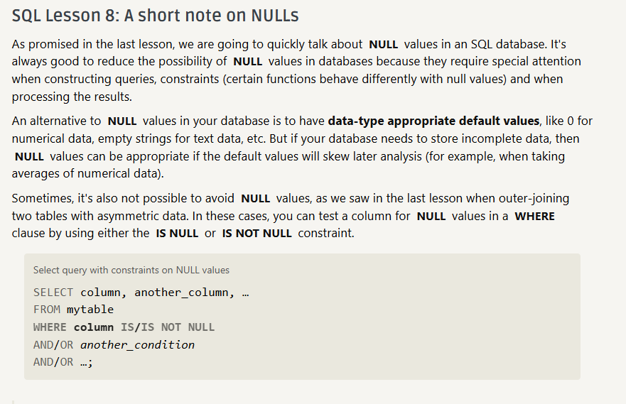

Find the name and role of all employees who have not been assigned to a building

```sql
SELECT * FROM employees
where building is null;
```

Find the names of the buildings that hold no employees

```sql
SELECT * FROM buildings
left join employees
on buildings.building_name = employees.building
where employees.building is null;
```

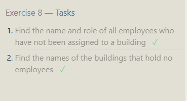

# Exercise 9 — Tasks

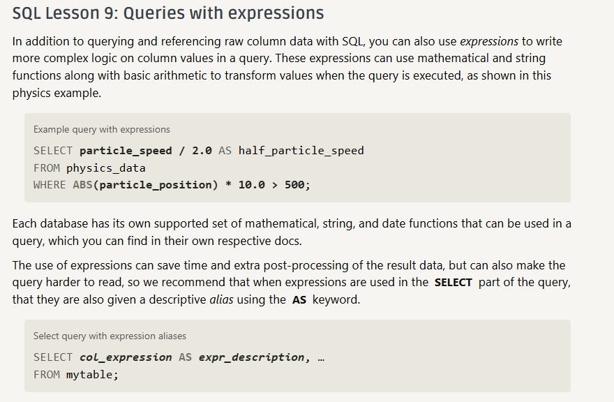
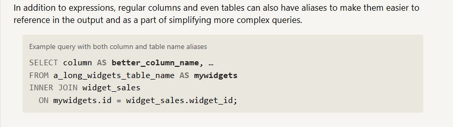

List all movies and their combined sales in millions of dollars

```sql
SELECT * , ((domestic_sales + international_sales)/1000000) as gross_sales
FROM movies
inner join boxoffice
on id = movie_id;
```

List all movies and their ratings in percent

```sql
SELECT *, (rating*10) as ratings
FROM movies
inner join boxoffice
on id = movie_id;
```

List all movies that were released on even number years

```sql
SELECT *
FROM movies
inner join boxoffice
on id = movie_id
where year%2 = 0;
```

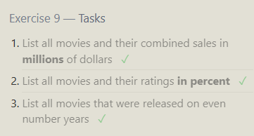

# Exercise 10 — Tasks

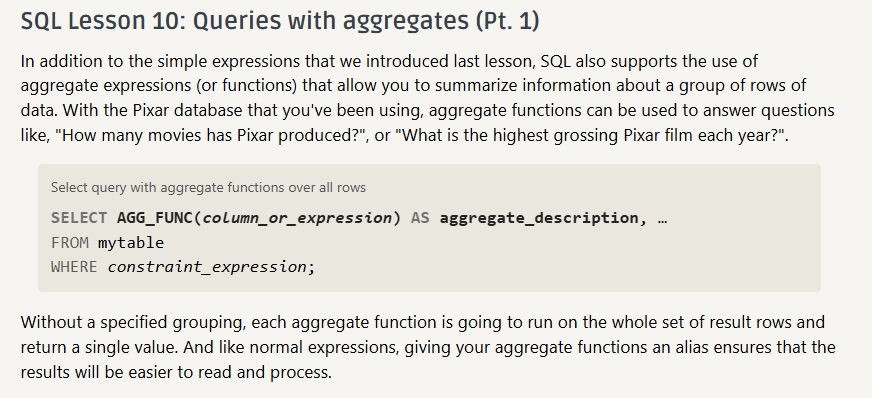
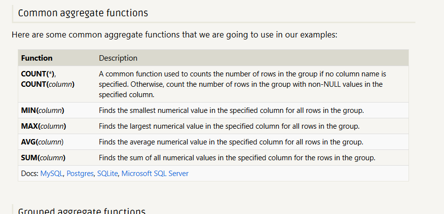
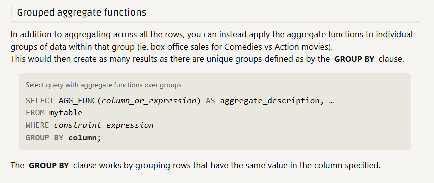

Find the longest time that an employee has been at the studio

```sql
SELECT *, Max(years_employed)
FROM employees;
```

For each role, find the average number of years employed by employees in that role

```sql
SELECT Role,  avg(years_employed)
FROM employees
group by role;
```

Find the total number of employee years worked in each building

```sql
SELECT building,  sum(years_employed)
FROM employees
group by building;
```

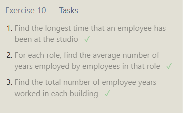

# Exercise 11 — Tasks

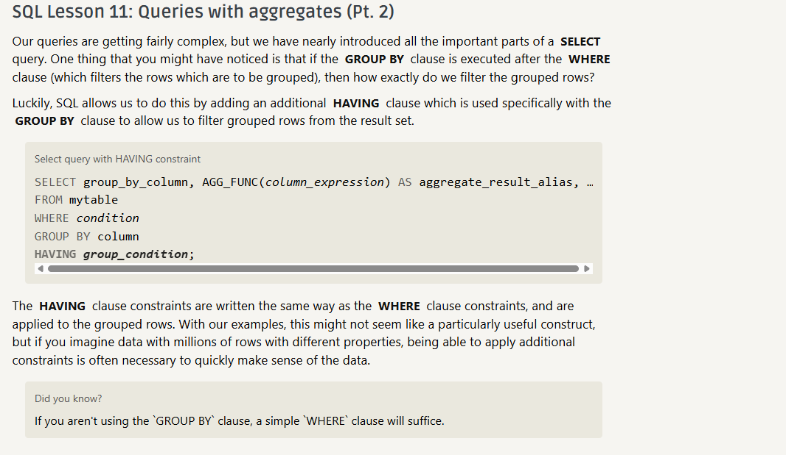

Find the number of Artists in the studio (without a HAVING clause)

```sql
SELECT role, count(role)
FROM employees
where role = "Artist";
```

Find the number of Employees of each role in the studio

```sql
SELECT role, count(role)
FROM employees
group by role;
```

Find the total number of years employed by all Engineers

```sql
SELECT *, sum(years_employed)
FROM employees
where role = "Engineer";
```

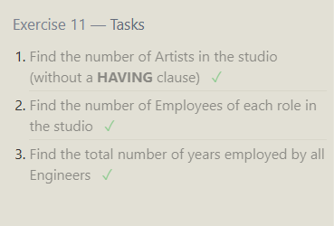

# Exercise 12 — Tasks

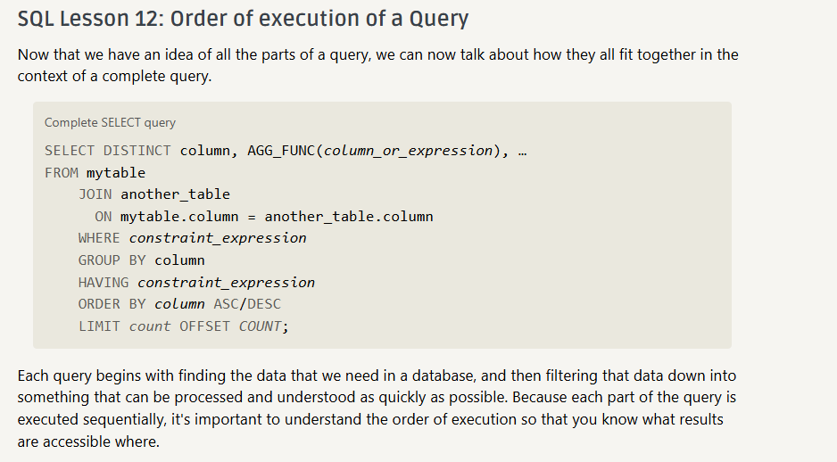
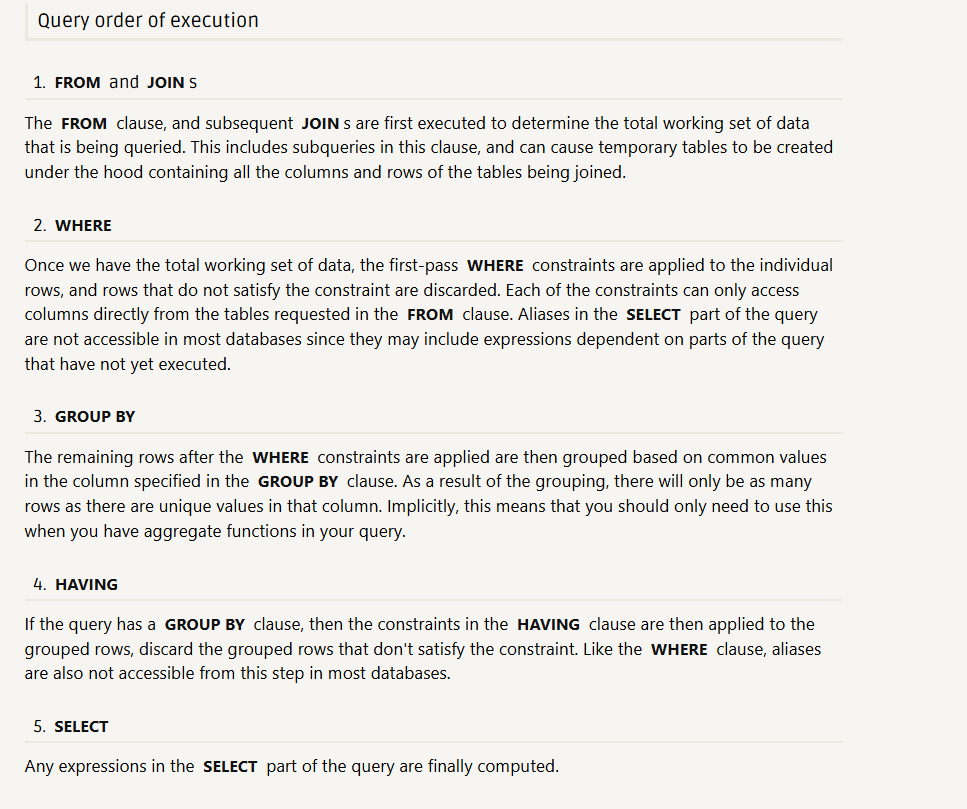
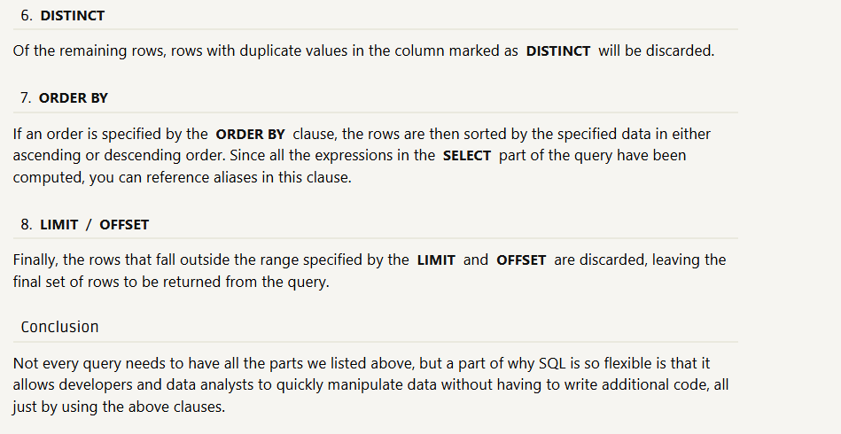

Find the number of movies each director has directed

```sql
SELECT director, count(director)
FROM movies
group by director;
```

Find the total domestic and international sales that can be attributed to each director

```sql
SELECT *, sum(domestic_sales + international_sales) as gross
FROM movies
INNER JOIN boxoffice
on id = movie_id
group by director;
```

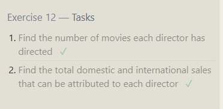
